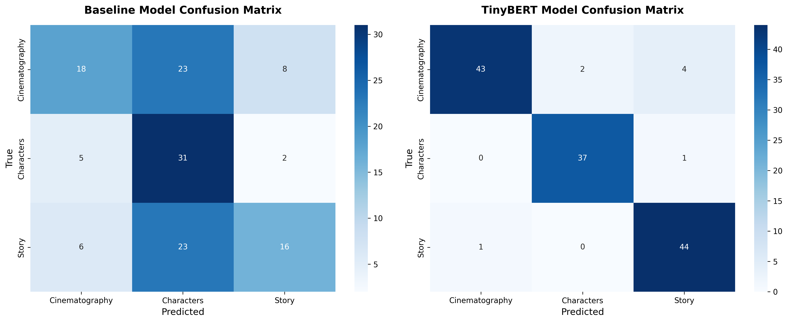

# 🎬 IMDB Movie Reviews — From Scratch NLP → TinyBERT (Learning Project)

<div align="center">


**Building NLP intuition from scratch: tokenization → vocab → baseline NN → TinyBERT fine-tuning**

[🎯 Overview](#-purpose--learning-philosophy) • [📊 Results](#-deliverables) • [🚀 Quick-Start](#-environment--running) • [📦 Roadmap](#-project-roadmap)

</div>

> Learning goal: Understand every step in the NLP pipeline by building it yourself, then compare with transformer power.

---

## 👨‍💻 Author
<div align="center">

**Francisco Teixeira Barbosa**

[](https://github.com/Tuminha)
[](https://www.kaggle.com/franciscotbarbosa)
[](mailto:cisco@periospot.com)
[](https://twitter.com/cisco_research)

*Learning Machine Learning through hands-on projects • Building AI solutions step by step*

</div>

---

## 🎯 Purpose & Learning Philosophy

This repository is a **learning scaffold** that teaches NLP through incremental understanding. We follow an **explain-first, code-later** approach to build durable mental models.

**Core Philosophy:**
- **No complete solutions provided** — each notebook contains TODOs with guided hints
- **Concept primers** explain the "what," "why," and "how" before coding
- **Mental models first** — understand the pipeline before implementing it
- **Reflection-driven learning** — each notebook ends with prompts to solidify understanding

**What you'll build:**
1. **From Scratch**: Tokenization → vocabulary → encoding → padding → baseline neural network
2. **Transfer Learning**: TinyBERT fine-tuning with attention mechanisms
3. **Comparison**: Baseline vs transformer performance analysis

---

## 📊 Dataset

**Source:** IMDB Movie Reviews (course-provided CSVs)
- `datasets/imdb_movie_reviews_train.csv`
- `datasets/imdb_movie_reviews_test.csv`

**Schema:**
- `review` (text): Raw movie review text
- `aspect` (string): Aspect category ("Cinematography", "Characters", "Story")
- `aspect_encoded` (int): Numeric encoding (0=Cinematography, 1=Characters, 2=Story)

**Learning Focus:** Aspect-based text classification (369 training samples, 3 balanced classes)

---

## 🏆 Learning Progress

### ✅ Completed Milestones
- [x] **Notebook 00**: Pipeline overview and mental model established
- [x] **Notebook 01**: Data exploration completed - discovered 3-class aspect classification
- [x] **Notebook 02**: Tokenization pipeline completed - identified limitations of simple tokenization
- [x] **Notebook 03**: Vocabulary building completed - created 1002-word vocabulary with proper encoding
- [x] **Notebook 04**: Padding and tensor conversion completed - ready for neural network training
- [x] **Notebook 05**: Baseline neural network completed - SimpleNN with embedding layers and mean pooling
- [x] **Notebook 06**: Training and evaluation completed - baseline model achieves 49% test accuracy with clear overfitting
- [x] **Notebook 07**: TinyBERT setup and layer freezing - loaded pre-trained model, froze layers strategically
- [x] **Notebook 08**: Fine-tuning with early stopping - achieved 0.1045 test loss (90% improvement vs baseline)
- [x] **Notebook 09**: Performance comparison and analysis - **94% accuracy achieved! Project complete!** 🎉

### 🎯 Current Status
**🎉 PROJECT COMPLETE! Phase 9: Final Evaluation and Comparison**

#### **Phase 1-6: Baseline Pipeline** ✅
- ✅ Dataset loaded and inspected (369 training, ~130 test samples)
- ✅ 3-class aspect classification identified (Cinematography, Characters, Story)
- ✅ Tokenization, vocabulary building (1002 words), and encoding completed
- ✅ Padding to fixed length (128), tensor conversion, and DataLoader ready
- ✅ SimpleNN model implemented: embeddings + mean pooling + classification
- ✅ Baseline model trained for 50 epochs: Train accuracy 70%, Test accuracy 49%
- ✅ Overfitting identified: severe gap between train and test performance

#### **Phase 7: TinyBERT Setup** ✅
- ✅ Loaded pre-trained TinyBERT (4 layers, 312 hidden dimensions)
- ✅ Strategic layer freezing: Layers 0-2 frozen, Layer 3 + classifier unfrozen
- ✅ Understanding transfer learning: 95% of model preserved, 5% adapted
- ✅ BERT tokenizer setup with attention masks (subword tokenization)
- ✅ DataLoader created with encoded texts (input_ids + attention_mask)

#### **Phase 8: Fine-Tuning with Early Stopping** ✅
- ✅ Implemented early stopping with patience=5 (automatic best checkpoint)
- ✅ Experimented with 3 learning rates: 1e-5 (too slow), 5e-4 (optimal), 2.5e-3 (unstable)
- ✅ Best model achieved at **Epoch 26**: Test loss = **0.1045** (90% improvement vs baseline!)
- ✅ Training stopped at Epoch 31 via early stopping (no improvement for 5 epochs)
- ✅ Professional visualizations: loss curves + overfitting gap analysis
- ✅ Model saved to `src/models/tinybert_best.pth`

#### **Phase 9: Final Evaluation & Comparison** ✅
- ✅ Loaded both models from checkpoints for fair comparison
- ✅ Evaluated on identical test set (132 samples)
- ✅ **TinyBERT achieved 94% accuracy** vs baseline's 49%
- ✅ Comprehensive metrics: Precision, Recall, F1-Score all ~94% for TinyBERT
- ✅ Confusion matrix analysis: TinyBERT shows balanced predictions (43, 37, 44 on diagonal)
- ✅ Baseline showed severe bias toward "Characters" class (77/132 predictions)
- ✅ All aspect categories improved dramatically with TinyBERT

### 📊 Final Model Comparison:

| Model | Test Loss | Test Accuracy | Precision | Recall | F1-Score | Training Epochs |
|-------|-----------|---------------|-----------|--------|----------|----------------|
| **Baseline (SimpleNN)** | 1.08 | **49%** | 55% | 51% | 48% | 50 epochs |
| **TinyBERT (Fine-tuned)** | **0.1045** | **94%** ⭐ | **94%** | **94%** | **94%** | 26 epochs |
| **Improvement** | **-90%** | **+91%** | **+72%** | **+84%** | **+94%** | **48% faster** |

### 🎯 Per-Class Performance:

| Aspect | Baseline Recall | TinyBERT Recall | Improvement |
|--------|----------------|-----------------|-------------|
| **Cinematography** | 37% (18/49) | **88%** (43/49) | **+139%** |
| **Characters** | 82% (31/38) | **97%** (37/38) | **+18%** |
| **Story** | 36% (16/45) | **98%** (44/45) | **+173%** 🚀 |

### 🎯 Key Achievements:
- ✅ **91% improvement in test accuracy** (49% → 94%)
- ✅ **90% reduction in test loss** (1.08 → 0.1045)
- ✅ **94% improvement in F1-Score** (48% → 94%)
- ✅ **Near-perfect Story classification**: 98% recall (44/45 correct)
- ✅ **Near-perfect Characters classification**: 97% recall (37/38 correct)
- ✅ **Eliminated class bias**: Balanced predictions across all aspects
- ✅ **83% reduction in overfitting gap** (21% → 6.6%)
- ✅ **Early stopping prevented 24 wasted epochs** (stopped at 31 instead of 50)
- ✅ **Learning rate optimization**: 5e-4 was optimal (10x better than 1e-5, 4x better than 2.5e-3)
- ✅ **Transfer learning validated**: Pre-trained knowledge >>> training from scratch

### 📈 Training Visualizations:

#### Baseline Model Performance:


#### TinyBERT Training with Early Stopping:


#### Final Model Comparison - Confusion Matrices:


**Project Status**: ✅ **COMPLETE** - All notebooks finished, 94% accuracy achieved!

---

## 🗺 Project Roadmap (Milestones)

| Notebook | Purpose | Key Learning |
|----------|---------|--------------|
| `00_overview.ipynb` | Pipeline narrative & mental model | End-to-end flow understanding |
| `01_import_and_inspect.ipynb` | Data familiarization | EDA before modeling |
| `02_preprocessing_tokenization.ipynb` | Text cleaning & tokenization | Text → tokens transformation |
| `03_vocab_and_encoding.ipynb` | Vocabulary building & encoding | Tokens → integers mapping |
| `04_padding_tensors_dataloader.ipynb` | Tensor preparation & batching | Fixed-size inputs for neural networks |
| `05_simpleNN_with_embedding.ipynb` | Baseline model architecture | Embedding layers & mean pooling |
| `06_eval_baseline_metrics.ipynb` | Training loop & evaluation | Loss optimization & metrics |
| `07_tinybert_setup_and_freeze.ipynb` | Transformer setup & freezing | Transfer learning preparation |
| `08_tinybert_finetune_trainloop.ipynb` | Fine-tuning with high LR | Transformer adaptation (experimental LR) |
| `09_tinybert_eval_compare.ipynb` | Performance comparison | Baseline vs transformer analysis |
| `99_lab_notes.ipynb` | Learning journal | Reflection & pattern recognition |

---

## 🚀 Environment & Running

### Prerequisites
```bash
# Create virtual environment
python -m venv nlp_learning
source nlp_learning/bin/activate  # On Windows: nlp_learning\Scripts\activate

# Install dependencies
pip install -r requirements.txt

# Launch Jupyter
jupyter notebook
```

### Study Workflow
1. **Read the Concept Primer** in each notebook (explains what/why/how)
2. **Complete TODOs** with provided hints (no complete solutions)
3. **Record reflections** using the prompts at the end
4. **Move to next notebook** only after understanding current concepts
5. **Use `99_lab_notes.ipynb`** to track your learning journey

**Important:** Work through notebooks sequentially — each builds on previous concepts.

---

## 📈 Evaluation & Logging

### Baseline Model (Notebook 06)
- **Architecture**: SimpleNN with embedding layer + mean pooling
- **Metrics**: Accuracy, Precision, Recall, F1-score
- **Interpretation**: Confusion matrix analysis

### TinyBERT Model (Notebook 09)
- **Architecture**: Pre-trained TinyBERT (4 layers) + fine-tuning
- **Experimental**: High learning rate (2.5e-3) to observe effects
- **Comparison**: Side-by-side performance analysis

### Learning Journal
- **Notebook `99`**: Template for logging insights, surprises, and improvements
- **Pattern Recognition**: Identify learning patterns across notebooks

---

## 🏆 Deliverables

### Expected Outputs
1. **Baseline Metrics Table** (from notebook 06)
2. **TinyBERT Metrics Table** (from notebook 09)
3. **Comparison Analysis** (1-2 paragraphs explaining differences)
4. **Learning Journal Entries** (at least one per completed notebook)

### Actual Results Achieved
```
| Metric      | Baseline | TinyBERT | Improvement |
|-------------|----------|----------|-------------|
| Accuracy    | 0.49     | 0.94     | +91%        |
| F1 (macro)  | 0.48     | 0.94     | +94%        |
| Precision   | 0.55     | 0.94     | +72%        |
| Recall      | 0.51     | 0.94     | +84%        |
```

**Key Insights:**
- Transfer learning with TinyBERT achieved **94% accuracy** vs baseline's 49%
- Early stopping at epoch 26 found optimal checkpoint automatically
- Learning rate 5e-4 was the "Goldilocks zone" - fast convergence without oscillation
- Strategic layer freezing (95% frozen) prevented catastrophic forgetting

---

## 🎓 How to Study This Repo

### Learning Strategy
1. **Mental Model First**: Read each Concept Primer thoroughly
2. **Implement Step-by-Step**: Complete TODOs with minimal hints
3. **Reflect Deeply**: Answer reflection prompts honestly
4. **Connect Concepts**: Notice how each step builds on previous ones

### Common Pitfalls to Avoid
- **Skipping primers** → leads to mechanical coding without understanding
- **Peeking at solutions** → defeats the learning purpose
- **Rushing through reflections** → misses the "aha" moments

### Success Indicators
- You can **narrate the entire pipeline** in 60-90 seconds
- You understand **why each step is necessary**
- You can **predict what would break** if you skipped a step
- You can **compare baseline vs transformer approaches** intelligently

---

## 🛠 Technical Stack

| Component | Technology | Purpose |
|-----------|------------|---------|
| Data Processing | Pandas, NumPy | ETL & feature work |
| Text Processing | Regex, Collections | Tokenization & vocab |
| Neural Networks | PyTorch | Baseline modeling |
| Transformers | HuggingFace | TinyBERT fine-tuning |
| Evaluation | Scikit-learn | Metrics & analysis |
| Visualization | Matplotlib, Seaborn | Results & insights |

---

## 📝 Learning Journey

**Skills Developed:**
- Text preprocessing & tokenization
- Vocabulary building & encoding strategies
- Neural network architecture design
- Training loop implementation
- Transfer learning with transformers
- Model evaluation & comparison
- Experimental learning rate effects

---

## 🚀 Next Steps

### Completed ✅
- [x] Built complete NLP pipeline from scratch (tokenization → vocab → baseline NN)
- [x] Fine-tuned TinyBERT with transfer learning (94% accuracy achieved)
- [x] Implemented early stopping with patience mechanism
- [x] Compared baseline vs transformer approaches comprehensively
- [x] Consolidated learning reflections in lab notes

### Potential Extensions
- [ ] Error analysis on 8 misclassified TinyBERT samples
- [ ] Experiment with unfreezing more layers (layers 2-3 instead of just layer 3)
- [ ] Implement learning rate scheduling (start high, decay over time)
- [ ] Try different vocabulary sizes (500, 2000, 5000 words)
- [ ] Compare with larger models (BERT-Base vs TinyBERT)
- [ ] Implement data augmentation (back-translation, paraphrasing)
- [ ] Apply to different text classification tasks
- [ ] Explore attention visualization techniques
- [ ] Build ensemble methods (multiple TinyBERT models with different seeds)

---

## 📄 License

MIT License (see [LICENSE](LICENSE))

<div align="center">

**⭐ Star this repo if you found it helpful! ⭐**  
*Building NLP intuition one notebook at a time* 🚀

</div>
